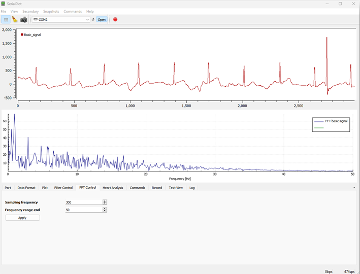
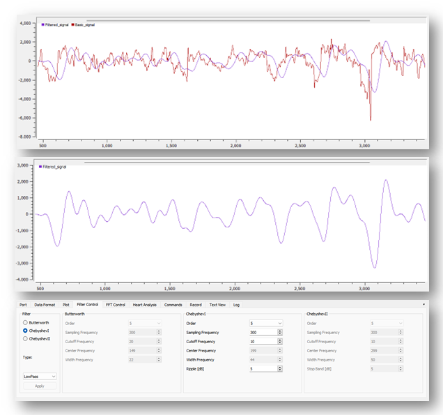
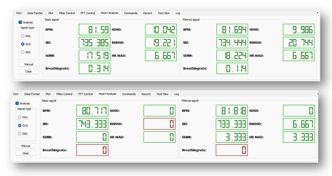

# SerialPlot for the analysis of biomedical signals

The modification of the software is aimed at adding the functionality of analyzing biomedical signals.

The application has been enriched with another graph that allows visualization of the FFT, IIR type filtration configuration tab and the ability to analyze the heart rhythm for the ECG and PPG signal. The application is designed to analyze and visualize ECG, PPG and EEG signals and was made as part of my master's thesis.







## Features

* Replacing deprecated functions against Qt5.15.2
* Added Discrete Fourier Transform
* Added IIR type filtration
* Added heart rate analysis

## Installation for Windows
### Qt5.15.2 installation with MinGW 8.1.0

Include the following in the system path:
* ```installation\path\to\Qt\Tools\mingw810_64\bin```
* ```installation\path\to\Qt\5.15.2\mingw81_64\bin```
* ```installation\path\to\Qt\5.15.2\mingw81_64\lib```

### Qwt 6.2.0

Manual installation of Qwt https://qwt.sourceforge.io/qwtinstall.html.
If there is a build error related to tests that are not required when using the library, you should disconnect them from the build process. In the qwtconfig.pri file, remove the line ```QWT_CONFIG += QwtTests```

Include the following in the system path:
- ```installation\path\to\qwt-6.2.0\lib```

In the configuration, set ```BUILD_QWT``` to ```false```.

### FFTW

The application uses the FFTW library to perform the Discrete Fourier Transform. The library can be downloaded from the website https://www.fftw.org/download.html. Remember to add the libraries folder to the system path.

### Python

Heart rate analysis using the Python HeartPy package has been implemented in the application https://python-heart-rate-analysis-toolkit.readthedocs.io/en/latest/#.

To run the python script in the application, it was required to integrate the Python interpreter, therefore, to run the application, the Python interpreter version 3.10 must be installed. Be sure to include it in the system path.

# SerialPlot - original

Small and simple software for plotting data from serial port in realtime.


## Features

* Reading data from serial port
* Binary data formats (u)int8, (u)int16, (u)int32, float
* User defined frame format for robust operation
* ASCII input (Comma Separated Values)
* Synchronized multi channel plotting
* Define and send commands to the device in ASCII or binary format
* Take snapshots of the current waveform and save to CSV file

See
[hackaday.io](https://hackaday.io/project/5334-serialplot-realtime-plotting-software)
page for [screenshots](https://hackaday.io/project/5334/gallery).

## Installation

You can obtain windows and linux binary packages hackaday.io page:

https://hackaday.io/project/5334-serialplot-realtime-plotting-software

## Dependencies

- Qt 5, including SerialPort module
- Qwt 6.1

## Building

### Obtain Dependencies

- Qt5 development packages
- Qt5 SerialPort module
- CMake
- Mercurial

Under Ubuntu/Debian:
```apt install qtbase5-dev libqt5serialport5-dev cmake mercurial```

Under OpenSUSE:
```zypper in libqt5-qtbase-devel libqt5-qtserialbus-devel libqt5-qtserialport-devel cmake mercurial```

### Download and Install Qwt [Optional]

[Qwt](http://qwt.sourceforge.net) is the library that provides
plotting widgets for SerialPlot. You have 3 different options for Qwt.

* Leave it to serialplot build scripts. Qwt will be downloaded and built for you.

* If your linux distribution has the `libqwt-qt5-dev` or `qwt-qt5-devel` or,
  on OpenSUSE, `qwt6-qt5-devel` package, 
  install it and set `BUILD_QWT` cmake option to `false`.

* Download Qwt 6 [here](http://sourceforge.net/projects/qwt/files/)
  and build it yourself per these
  [instructions](http://qwt.sourceforge.net/qwtinstall.html#qwtinstall-unix)
  and install. Make sure you use Qt5 (not Qt4) to build. And set
  `BUILD_QWT` cmake option to `false`.

### Download and Build SerialPlot

You can use Mercurial to download SerialPlot source code. Or you can
download it from here:
https://hg.sr.ht/~hyozd/serialplot/

    hg clone https://hg.sr.ht/~hyozd/serialplot/
    cd serialplot
    mkdir build && cd build
    cmake ..
    make

You can also build with QtCreator IDE (or qmake) using `serialplot.pro` file.

## Known Issues

- On Ubuntu 16.04 / Linux Mint 18, removing USB serial device while it
  is open in SerialPlot, causes application to go into a nasty loop
  and eventually it crashes. This is a bug of Qt 5.5. I have uploaded
  a patched version of the problematic `libqt5serialport5` package to
  launchpad ppa. If you install SerialPlot from there or use AppImage binary, you shouldn't
  have any problems.

## License

This software is licensed under GPLv3. See file COPYING for details.
